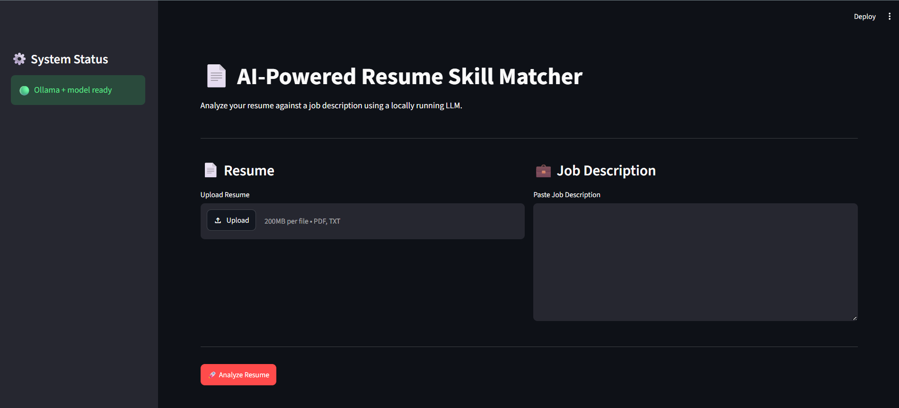
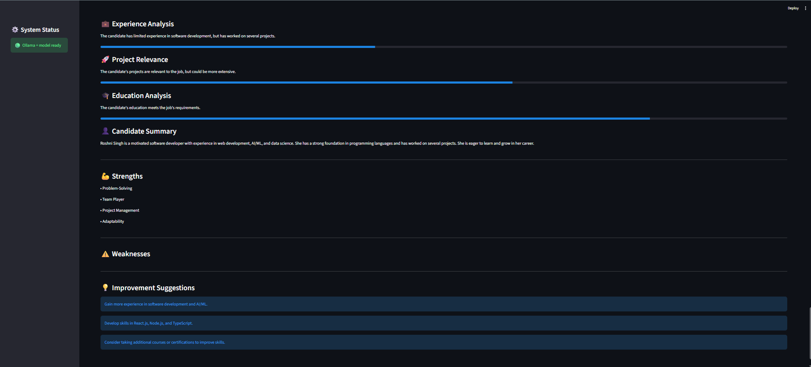
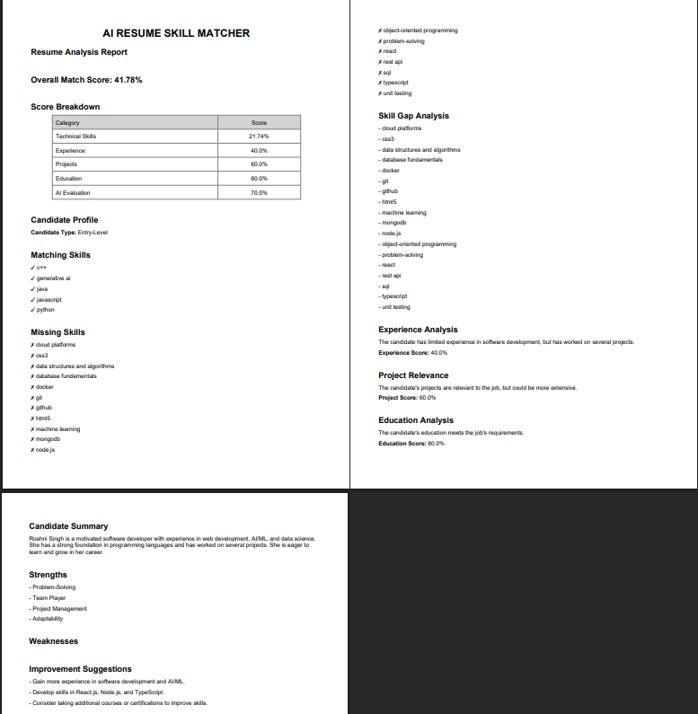

# 📄 AI-Powered Resume Skill Matcher

An AI-powered resume screening application that analyzes a candidate's resume against a job description using a locally running Large Language Model (LLM).

The application identifies matching skills, missing skills, experience alignment, education relevance, project relevance, overall suitability, and improvement suggestions.

---

## 🚀 Features

- 📄 Upload resumes in PDF or TXT format
- 💼 Paste a job description
- 🤖 Analyze resumes using a locally running Ollama LLM
- 🎯 Calculate technical skill match
- ✅ Identify matching skills
- ❌ Identify missing skills
- 📚 Analyze skill gaps
- 👤 Generate candidate summary
- 💪 Identify candidate strengths
- ⚠️ Identify weaknesses
- 💼 Analyze professional experience
- 🎓 Analyze education relevance
- 🚀 Analyze project relevance
- 📊 Calculate overall suitability score
- 💡 Generate improvement suggestions
- 📥 Generate downloadable PDF analysis reports
- 🧪 Automated tests using pytest

---

## 🏗️ System Architecture

```text
                    ┌──────────────────────┐
                    │      Streamlit       │
                    │      Web Interface   │
                    └──────────┬───────────┘
                               │
                               ▼
                    ┌──────────────────────┐
                    │    Resume Parser     │
                    │      PDF / TXT       │
                    └──────────┬───────────┘
                               │
                               ▼
             ┌─────────────────────────────────┐
             │       Resume Analysis Engine    │
             │                                 │
             │  Skill Matching                 │
             │  Skill Gap Analysis             │
             │  Experience Analysis            │
             │  Education Analysis             │
             │  Project Analysis               │
             └───────────────┬─────────────────┘
                             │
                             ▼
                    ┌──────────────────────┐
                    │      Ollama LLM      │
                    │     llama3.2:3b      │
                    └──────────┬───────────┘
                               │
                               ▼
                    ┌──────────────────────┐
                    │    Analysis Result   │
                    │                      │
                    │ Match Score           │
                    │ Missing Skills        │
                    │ Candidate Summary     │
                    │ Recommendations       │
                    └──────────┬───────────┘
                               │
                               ▼
                    ┌──────────────────────┐
                    │    PDF Report        │
                    └──────────────────────┘


🛠️ Tech Stack
Technology	    Purpose
Python	        Application development
Streamlit	    Web interface
Ollama	        Local LLM execution
Llama 3.2 3B	Resume analysis
Pydantic	    Structured LLM output validation
PyPDF	        PDF resume extraction
ReportLab	    PDF report generation
Pytest	        Automated testing

📂 Project Structure
Resume-skill matcher/
│
├── app.py
├── llm.py
├── matcher.py
├── models.py
├── prompts.py
├── resume_parser.py
├── skill_extractor.py
├── skill_gap.py
├── pdf_report.py
│
├── data/
│   ├── sample_resume.txt
│   └── sample_job.txt
│
├── reports/
│
├── tests/
│   ├── __init__.py
│   ├── test_matcher.py
│   ├── test_skill_gap.py
│   └── test_resume_parser.py
│
├── .gitignore
├── requirements.txt
└── README.md


⚙️ Installation
1. Clone the repository
git clone https://github.com/Roshni-Singh27/resume-skill-matcher.git
cd Resume-skill-matcher
2. Create a virtual environment
python -m venv venv
3. Activate the environment
venv\Scripts\activate
4. Install dependencies
pip install -r requirements.txt


🤖 Ollama Setup
This project uses Ollama for local LLM execution.

Install Ollama on your system and download the required model:
ollama pull llama3.2:3b
Verify that the model is available:
ollama list
You should see:
llama3.2:3b
Make sure Ollama is running before starting the application

▶️ Run the Application
Start the Streamlit application:
streamlit run app.py
The application will open in your browser.

Upload a resume, paste a job description, and click:
🚀 Analyze Resume

🧪 Run Tests
The project includes automated tests for core functionality.

Run all tests:
python -m pytest -v
Current test coverage includes:

Skill matching
Missing skill detection
Perfect skill match
No skill match
Empty resume skills
Empty job skills
Case-insensitive matching
TXT resume parsing
Skill-gap analysis
Empty skill-gap analysis


📊 Analysis Output
The application generates:

Technical Analysis
    Matching Skills
    Missing Skills
    Technical Skill Match Score

AI Analysis
    Candidate Summary
    Strengths
    Weaknesses
    Experience Match
    Education Match
    Project Match
    Suitability Score

Recommendations
    Skill-gap priorities
    Improvement suggestions

Report
A downloadable PDF report containing the analysis results.


## 🖥️ Application Preview

### Resume Upload Interface



### Resume Analysis Results


### Skill Gap Analysis



### Downloadable PDF Report




🔒 Local AI
The project is designed around local LLM execution using Ollama.

Resume content is processed through the locally running model rather than requiring a paid external AI API.

⚠️ Deployment Note
The default implementation requires Ollama and the llama3.2:3b model to be available to the application.

A standard cloud deployment cannot directly access Ollama running on the developer's personal computer.

For a public deployment, the application would require a separately hosted inference service or a cloud-hosted LLM runtime.

🔮 Future Enhancements
    Multiple resume comparison
    Job recommendation system
    Resume ranking
    Semantic skill matching
    ATS compatibility analysis
    Resume improvement suggestions
    User authentication
    Analysis history
    Dashboard and analytics
    Cloud-based LLM deployment
    Docker support
    More advanced NLP-based skill extraction


👩‍💻 Author
Roshni Singh

B.Tech Computer Science and Engineering

📜 License
This project is intended for educational and portfolio purposes.

